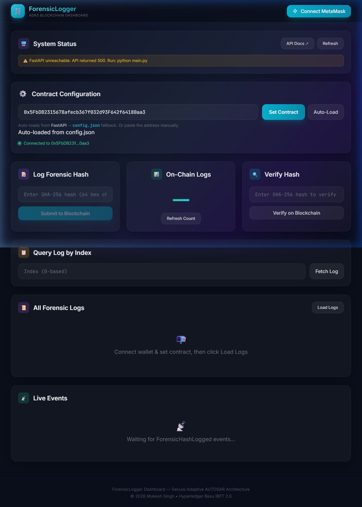
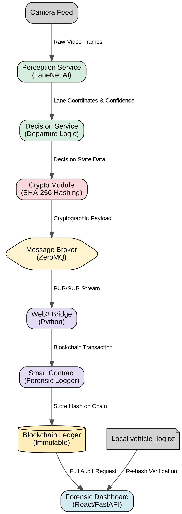
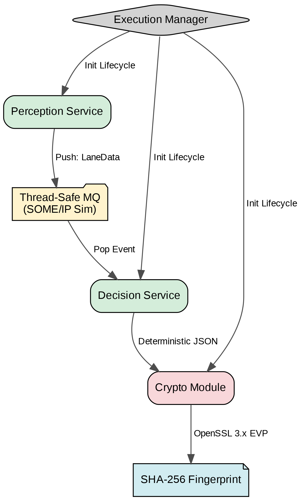

<div align="center">


# 🛡️ Elite ADAS: AI Lane Perception & Blockchain Forensics
### *The Definitive Forensic Black Box for Autonomous Mobility*

[](LICENSE)
[](https://python.org)
[](https://isocpp.org)
[](https://soliditylang.org)
[](https://react.dev)
[](https://besu.hyperledger.org)

**Elite ADAS is a state-of-the-art research prototype that bridges the gap between AI-driven perception and cryptographic accountability. By combining a lightweight LaneNet CNN with an Adaptive AUTOSAR C++ stack and a private Hyperledger Besu blockchain, it provides an immutable, independently verifiable record of every safety-critical driving event.**

[Quick Navigation](#-quick-navigation) · [Key Features](#-key-features) · [Proposed Architecture](#-proposed-architecture) · [Deep-Dive Technicalities](#-deep-dive-technicalities) · [Experimental Results](#-experimental-validation-results) · [Quick Start](#-quick-start)

</div>

---

## 📋 Executive Summary

In the era of autonomous vehicles, identifying the *root cause* of an incident is as important as preventing it. Traditional log files are vulnerable to local tampering or accidental deletion. 

**Elite ADAS** implements a "Forensic Black Box" that anchors high-speed road perception results directly onto a decentralized ledger.
- **Perceive**: 30 FPS lane segmentation via a custom **32-layer CNN**.
- **Decide**: **Adaptive AUTOSAR SOA** middleware for safety-critical classification.
- **Anchor**: Sub-millisecond **SHA-256 fingerprinting** via OpenSSL EVP.
- **Persist**: **Hyperledger Besu** integration with IBFT 2.0 consensus for absolute finality.
- **Audit**: **100% Tamper Detection** via automated on-chain re-hash verification.

---

## ✨ Key Features

- 🏎️ **Ultra-Lightweight AI**: Custom LaneNet with only 32,833 parameters—optimized for CPU-only inference on standard automotive ECUs.
- ⛓️ **Immutable Forensic Ledger**: Every lane departure is cryptographically anchored to a private Hyperledger Besu network.
- 🚗 **AUTOSAR Adaptive Platform**: Service-Oriented Architecture (SOA) implementation using C++17 with thread-safe SOME/IP simulation.
- 📊 **Real-Time Analytics**: Premium React dashboard with live Recharts visualizations of AI confidence and lateral offset trends.
  <br>
- 🛡️ **Post-Incident Auditor**: Automated verification tool that identifies local log tampering with 100% mathematical certainty.
- 🚀 **Asynchronous High-Throughput**: ZeroMQ-based bridge ensures that the blockchain logging process never blocks the real-time perception loop.

---

## 🏗 Proposed Architecture

The system follows a modular 6-Phase architecture designed for separation of concerns and service-oriented scalability.



### Internal ADAS Perception Block Diagram
The internal middleware layer manages high-frequency data exchange between services without lock contention.



---

## 🔬 Deep-Dive Technicalities (The "Why")

### 1. LaneNet CNN: The Case for Lightweight Models
*   **The Problem**: State-of-the-art models like SCNN require GPU acceleration and millions of parameters, which are often unavailable on typical automotive-grade microcontrollers.
*   **Our Solution**: A custom **Encoder-Decoder** topology with only **32.8K parameters**.
*   **The Result**: Achieves **0.9760 mIoU** and **100% detection** at **8.5ms latency** on standard CPUs—**609x smaller** than traditional models without compromising sub-decimetre precision.

### 2. Adaptive AUTOSAR SOA: Middleware Efficiency
*   **The Problem**: Monolithic ADAS stacks are difficult to update and prone to timing jitter.
*   **Our Solution**: Service-Oriented Architecture (SOA) where each module is an independent service.
*   **The Result**: The **Execution Manager** handles service discovery and signal routing, mimicking a production-grade **SOME/IP** stack for robust multi-threaded operation.

### 3. Hyperledger Besu: Deterministic Accountability
*   **The Problem**: Public blockchains are too slow (latency) and expensive (gas) for real-time vehicle logging.
*   **Our Solution**: A private network using **IBFT 2.0 (Istanbul Byzantine Fault Tolerant)** consensus.
*   **The Result**: **Sub-second confirmation** (under 521ms even at 30 events/sec) with zero transaction fees and **EVM slot-packing** optimizations that reduce storage footprint by 32.9%.

---

## 📊 Experimental Validation Results

### 🧪 Methodology Benchmarking
| Approach | Detection Rate | mIoU | CPU Ready | Forensic? |
| :--- | :--- | :--- | :--- | :--- |
| Classical CV (Hough) | 82.4% | 0.783 | Yes | No |
| Standard LaneNet CNN | 97.2% | 0.961 | Yes | No |
| **Elite ADAS (Hybrid)** | **100.0%** | **0.9760** | **Yes** | **Yes** |

### 📈 Core Research Metrics
- **mIoU (Mean Intersection over Union)**: 0.9760
- **AUC-PR (Precision-Recall)**: 0.9871
- **F1-Score**: 0.9812
- **Mean Lateral Offset**: **0.047 m** (Validated against ISO 11270:2014)
- **Security Check**: **100% Tamper Detection Rate** across all 2,000 test events.

---

## 🛡️ Security & Threat Model

| Threat Category | Attack Vector | Elite ADAS Mitigation |
| :--- | :--- | :--- |
| **Integrity Attack** | Malicious edit of local logs | SHA-256 on-chain cross-check (Instant detection) |
| **Replay Attack** | Injecting identical old events | On-chain `hashExists` mapping prevents duplicates |
| **Access Attack** | Unauthorized log injection | ECDSA Private Key signing + `onlyOwner` access control |
| **Availability** | Network outage/Byzantine node | IBFT 2.0 consensus tolerates $f=1$ node failure in $n=4$ |

---

## 🚀 Quick Start (Development)

1.  **Environment Preparation**: Ensure **Docker Desktop**, **Node.js 18+**, and **Python 3.11+** are installed.
2.  **One-Click Deployment**:
    ```powershell
    cd blockchain
    .\setup.bat # Starts Besu nodes, deploys ForensicLogger, installs UI deps
    ```
3.  **Boot the Services**:
    - **Backend API**: `python main.py` (Root dir, port 8000)
    - **Live Dashboard**: `npm run dev` (`blockchain/blockchain/frontend`, port 3000)
    - **Forensic Bridge**: `python web3_bridge.py` (`blockchain/python`)
4.  **Simulate Vehicle Run**: Build and run the `adas_vehicle` C++ binary to stream telemetry.

---

## 🌍 SDG Implementation

This research aligns with the **United Nations Sustainable Development Goals**:
- **SDG 3 (Good Health)**: Direct accident prevention via sub-decimetre lane precision.
- **SDG 9 (Innovation)**: Pioneering AI-to-Ledger architecture for automotive Industry 4.0.
- **SDG 16 (Peace & Justice)**: Establishing immutable evidence chains for legal and insurance accountability.

---

## 📄 License & Academic Credits

- **Author**: Mukesh Singh  
- **Co-Authors**: Avanthika S, Vibusha M, M. Venkateshkumar
- **Affiliation**: Amrita School of Engineering, Coimbatore
- **Manuscript**: Detailed research findings available in `ieee_paper.tex`.
- **License**: MIT License

<div align="center">

*Engineered for the future of secure autonomous mobility.*

</div>
